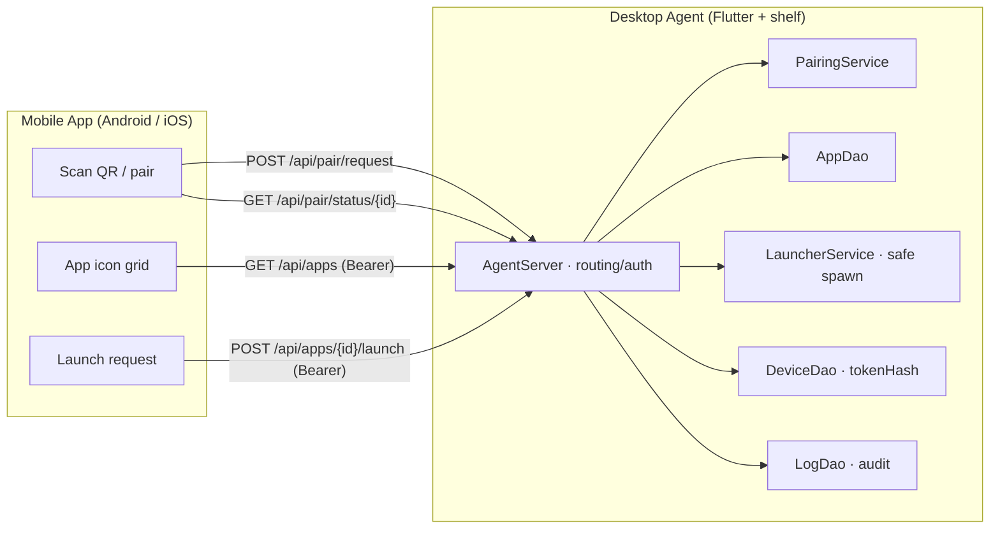
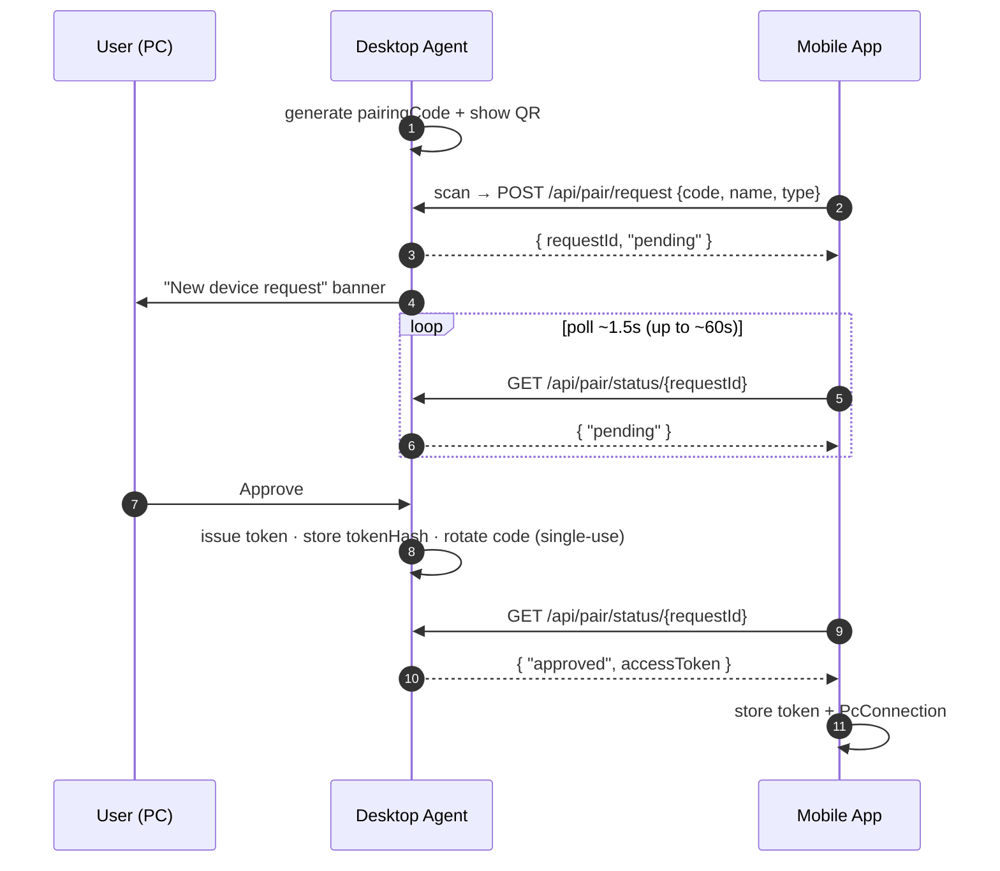
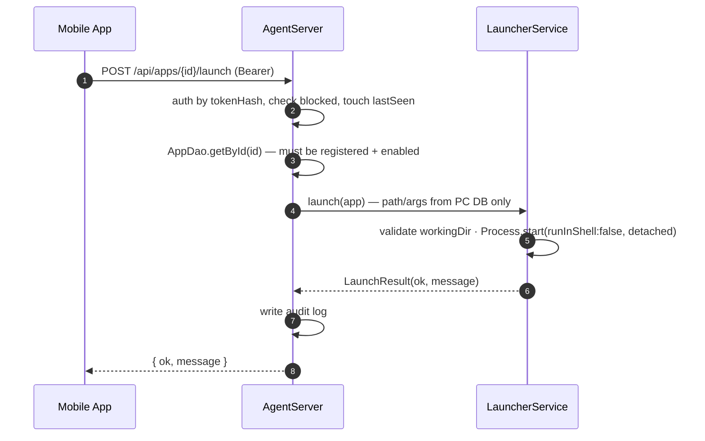

# Remote Launcher — Project Overview (English)

> A safe remote launcher that runs **only pre-registered PC programs** from a phone.
> There is **no** arbitrary command / shell / remote-script execution.

- Doc version: 0.1.0 (MVP)
- Date: 2026-06-17
- See also: [`PROJECT.md`](./PROJECT.md) (Korean, full) · [`openapi.yaml`](./openapi.yaml)

---

## 1. What it is

On the same Wi-Fi/LAN, the mobile app talks to a Desktop Agent over HTTP and launches
programs the PC has **pre-registered** (VSCode, Obsidian, Chrome, …) by tapping an icon.

Core principle: **the phone only sends an `appId`.** The actual executable path,
arguments and working directory come exclusively from PC-side configuration, so there is
no surface for the phone to inject commands.

---

## 2. Goals / Non-goals

**Goals (MVP):** Desktop Agent for Windows/macOS/Linux, Mobile app for Android/iOS,
register/edit/delete programs on the PC, show them as icons on mobile and launch on tap,
QR pairing + token auth + launch logs, works on the same LAN.

**Non-goals (this MVP):** public-internet exposure / port-forwarding (use VPN/Tailscale
instead), arbitrary command execution (intentionally absent), Linux `.desktop` `Exec=`
parsing, automatic device-name detection, mDNS discovery.

---

## 3. Tech stack

| Area | Choice |
| --- | --- |
| Framework | Flutter (single codebase, desktop + mobile) |
| State | Riverpod (`AsyncNotifier`-based CRUD) |
| Storage | SQLite — desktop `sqflite_common_ffi`, mobile `sqflite` |
| HTTP server | `shelf` + `shelf_router` (embedded in the agent) |
| QR | `qr_flutter` (desktop, generate) / `mobile_scanner` (mobile, scan) |
| Security | `crypto` (SHA-256), `Random.secure` for tokens/codes |
| Other | `uuid`, `file_picker` (desktop), `http` (mobile), `path_provider` |

---

## 4. Monorepo layout

```
remote_launcher/
├── README.md                  # quick start + permission snippets
├── docs/                      # PROJECT.md, PROJECT.en.md, openapi.yaml
├── packages/shared/           # pure-Dart shared models / DTOs / utils
└── apps/
    ├── desktop_agent/         # Windows/macOS/Linux
    └── mobile_app/            # Android/iOS
```

Platform runner folders (`android/ ios/ windows/ macos/ linux/`) are machine/version
specific and are generated with `flutter create .` (not committed).

---

## 5. Architecture



- Server binds to `InternetAddress.anyIPv4` (default port 8765) so LAN devices can reach it.
- Auth is a per-handler helper (`_authenticate`), not middleware, to avoid arity clashes
  with shelf_router path params (`<id>`).
- One-way data flow (phone → PC requests). The PC never pushes to the phone.

---

## 6. Data models (summary)

- **LaunchApp** (PC-only): `id, name, executablePath, arguments[], workingDirectory?,
  iconPath?, enabled, createdAt, updatedAt`. Path/args never leave the PC.
- **AppListItem** (sent to mobile): `id, name, iconBase64?, enabled` — no path/args.
- **PairedDevice** (PC): `id, deviceName, deviceType, tokenHash (SHA-256), createdAt,
  lastSeenAt, blocked`. Token plaintext is never stored on the PC.
- **LaunchLog** (PC): `id, deviceId?, deviceName, appId, appName, timestamp, success, message`.
- **PcConnection** (mobile): `id, agentName, host, port, accessToken (plaintext, mobile-only),
  platform, addedAt, lastConnectedAt?`.
- **PairingPayload** (QR): `{ agentName, host, port, pairingCode }`.

---

## 7. HTTP API

Full contract in [`openapi.yaml`](./openapi.yaml). JSON only; no CORS.

| Method | Path | Auth | Description |
| --- | --- | --- | --- |
| GET | `/api/health` | none | status / name / platform / version |
| POST | `/api/pair/request` | pairing code | create a pairing request |
| GET | `/api/pair/status/{requestId}` | none | poll approval (token on approve) |
| GET | `/api/apps` | Bearer | list enabled apps |
| POST | `/api/apps/{id}/launch` | Bearer | launch a registered app |

---

## 8. Pairing flow



---

## 9. Launch flow



`args` always come from `LaunchApp.arguments`; the phone cannot supply them.

---

## 10. Security model

- ✅ Phone launches by `appId` only; path/args/workingDir are PC DB values.
- ✅ `Process.start(..., runInShell: false)` — no shell, no command-injection surface.
- ✅ Unknown/disabled `appId` rejected.
- ✅ Access token stored as **SHA-256 hash only** on the PC; plaintext stays on the phone.
- ✅ Pairing code is single-use and auto-rotates after approval.
- ✅ Every launch is audited.
- ✅ Devices can be blocked/deleted; blocked → 403.
- ✅ No CORS; security headers added.
- ✅ Missing executable/working dir is validated → clear error.
- ⚠️ **Do not expose the port to the public internet.** Use a VPN/Tailscale for remote access.

---

## 11. Feature summary

**Desktop Agent** — tabs: **Status** (agent state, PC name, port, LAN IPs, pairing QR),
**Apps** (add/edit/delete, test-run, mobile-visibility toggle), **Devices** (block/delete,
last-seen), **Logs**, **Settings** (name, port + restart, server start/stop). A pairing
approval banner is shown across all tabs.

**Mobile App** — **PC list** (add via QR), **QR scan** (auto pairing with status/retry),
**Launcher** (icon grid, tap to launch, success/failure toast, pull-to-refresh, friendly errors).

---

## 12. Run / build

Prereq: Flutter 3.19+ / Dart 3.3+, per-OS toolchain.

```bash
# shared package
cd remote_launcher/packages/shared && dart pub get && dart analyze && dart test

# Desktop Agent
cd ../../apps/desktop_agent
flutter create . --platforms=windows,macos,linux   # generate runners (keeps lib/, pubspec)
flutter pub get && dart fix --apply && flutter analyze
flutter run -d windows        # or macos / linux

# Mobile App (real device recommended — needs camera)
cd ../mobile_app
flutter create . --platforms=android,ios
flutter pub get && dart fix --apply && flutter analyze
flutter run
```

Then: register apps on desktop → scan the Status-tab QR on mobile → approve on desktop →
tap an icon on mobile → see it in the Logs tab.

---

## 13. Platform permissions

- **Android** (`AndroidManifest.xml`): `INTERNET`, `CAMERA` (+ optional
  `android:usesCleartextTraffic="true"` for LAN HTTP on some devices).
- **iOS** (`Info.plist`): `NSCameraUsageDescription`, `NSLocalNetworkUsageDescription`.
- **macOS** (entitlements): `network.server`, `network.client`,
  `files.user-selected.read-only`.
- **Linux**: `libsqlite3` installed; no special permissions.
- **Windows**: allow the firewall LAN prompt on first run.

Copy-paste snippets are in [`../README.md`](../README.md).

---

## 14. Known limits & next steps

- Mobile token currently in plaintext SQLite → harden with `flutter_secure_storage`.
- Device name is a fixed string → use `device_info_plus`.
- No PC auto-discovery → add mDNS/Bonjour (`multicast_dns`).
- No external access yet → add Tailscale/WireGuard guide.
- No Linux `.desktop` `Exec=` parsing (later).
- Pairing status uses polling → consider SSE/WebSocket later.
- Platform runner folders are generated via `flutter create .` (not committed).
- This environment has no Flutter toolchain, so `flutter analyze` / runtime checks must be
  run in your own environment.
